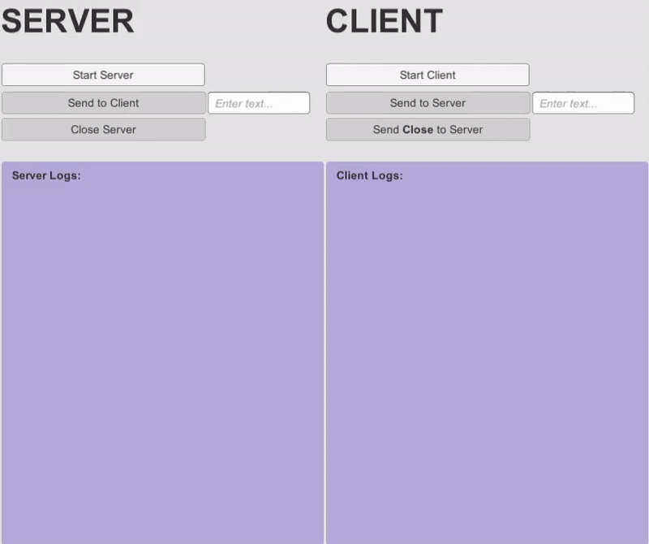

# SimpleUnityTCP 🖧 

A simple **demo-project** to show how **TCP** communication works on **Unity** environment, builded with **C#** and using [System.Net.Sockets](https://docs.microsoft.com/es-es/dotnet/api/system.net.sockets?view=netframework-4.7.2). 

The main porpouse of this repo is to show the TCP communication on runtime, but also to provide a pretty commented and clear code so everyone else that wants to implement that kind of communication will be able without wasting a lot of time.

## Video-Example 📲

  

## How to Use 💻
If you only want to see the app working, just run the ``SimpleTCP.exe`` which is located on the ``build`` directory.

If you want to open the project, you will need to have **Unity** installed with the **version 2017 or higher**.

If you only want to scratch the code, either inside the unity project or simply dragging the **.cs** classes on your editor, you have to watch on to this classes, which are located on ``Assets``:

* ``Server.cs``
* ``Client.cs``

## More Explanations 📡
**Note:** Unity do not allow the *save-use* of **Multi-Threading**, so the application is using **Co-routines** instead.

The stablished communication and workflow stablished right now follows the next order:

* **Start the Server** and let him waiting for client connections.
* **Start the Client** and connect him to the server.
* **Server waits** for client messages...
* **Client send** the message *Close* to the server.
* **Server recives** that *Close* message.
* **Server send a response** to the client, sending the same message, *Close*.
* **Client recives** the message, **close the connection** with the server and shuts down.
* **Server close the connection** with the client.
* **Server shuts down**